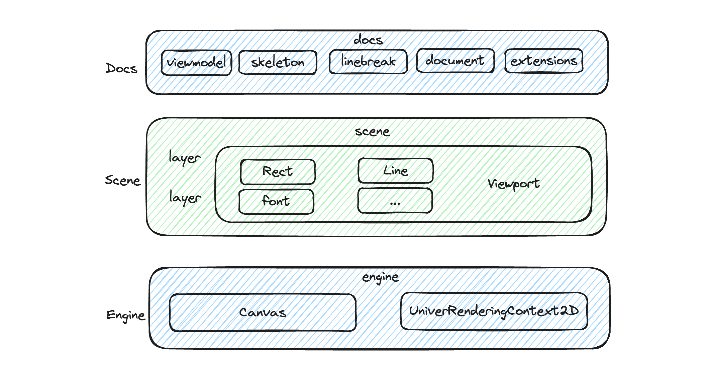
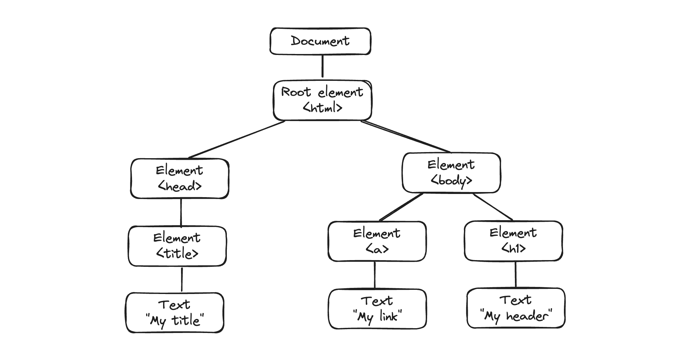
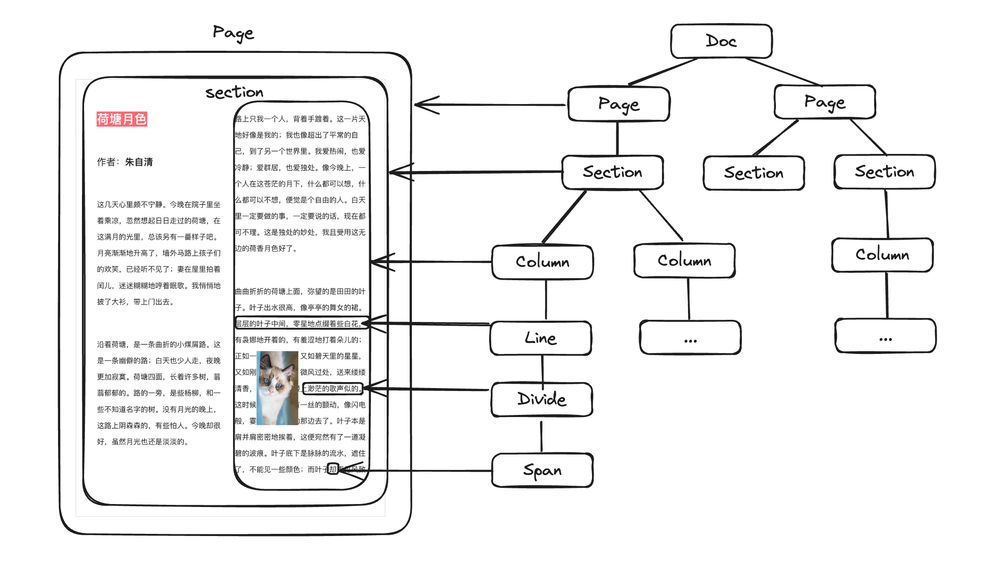

> Univer 文档是 Univer 办公套件之一，如果你想了解 Univer 文档架构，建议先阅读《Univer 文档架构及模块设计》，里面有关于 Univer 文档架构的思考和模块划分的设计，本篇文章主要关注文档排版需求及 Univer 文档是如何通过架构设计来服务这些需求的

## 文档排版的技术选型

我们使用编辑器的目的之一就是进行文档的编辑和排版，如使用 Word 和 LaTeX 等专业排版系统，进行学术论文、法律文书、企业合同等的编写和排版，作为一款旨在提供极致的文档编辑体验、及优良的排版系统的软件，Univer 文档从一开始就在架构设计及技术选型上做了取舍，为之后高度定制化的文档排版提供可能

Univer 文档编辑器放弃了传统的通过 DOM contenteditable 属性来实现富文本编辑器，而是选型了难度系数更高，挑战更大的 Canvas 元素来渲染整篇文档内容，因为 Canvas 可以在绘制文本位置、标点符号大小、行内样式等上高度自定义，并且实现复杂的中西文混合排版，这在 DOM contenteditable 实现的富文本编辑器上是难以实现的

下面罗列一些我们排版上的需求功能点：

- _多语言多地区的支持，中文排版、日文排版以及西文排版都有些微差异，我们需要支持差异化排版需求，即使在中文排版中，香港、澳门、台湾的中文排版也有差异_
- _在进行文字排版时，除了汉字外也有标点符号，也会与阿拉伯数字、拉丁文字、希腊文字等西文混排_
- _需支持横排、竖排，密排、疏排、均排等_
- _需支持多种字体及引入自定义字体_
- _文字尺寸、字体种类、文字书写方向（竖排、横排、斜排等）、分栏（栏数及栏距）、图文混排、文字和表格的混排、一页的行数、网格、字距、行距等_
- _标点符号的字形、尺寸与字面的分布，标点符号宽度调整_
- _行首、行尾标点符号禁则_
- _行尾点号悬挂_
- _行内挤压和拉升_
- _中文排版中相邻行汉字上下对齐_

上面还只是罗列了在文字排版需求上的冰山一角，完全依赖于浏览器 DOM 元素（contenteditable 实现的文字排版系统）自身的文字排版系统已经开始捉襟见肘了，这也是为什么一些阅读软件（微信阅读）在做技术选型上选择 Canvas 来排版和渲染的原因之一

## 视图层的架构

有了上面的技术选型，我们来看看 Univer 文档视图层架构

### 2.1 整体架构图



自下而上来介绍视图层的架构：

**引擎层**：最底层是视图层的引擎层，它包含了 Canvas 类，Canvas 类是对浏览器 Canvas 元素的一个抽象，通过该层抽象，我们可以创建 Canvas 元素、设置 Canvas 元素尺寸，以及绑定 UniverRenderingContext2D 实例对象等，通过 UniverRenderingContext2D 对象，可以调用 Canvas Context2D 提供的所有绘制能力，比如绘制矩形、圆形、文字、线条、设置绘制样式等，有了这些绘制能力，就可以李彤 Canvas Context2D 来绘制 Doc 中的文字、删除线、下划线等内容了

引擎层也提供了 Canvas 事件代理，构建了一套引擎层的用户交互事件系统，这样就可以事件分发给 Scene 中真实命中的 Object，然后由 Object 上的事件处理函数处理，关于事件系统的介绍可以参阅《Univer 文档架构及模块设计》

同时引擎层提供了 render 循环，支持同时运行多个 render function，通过一个定时器会去循环执行 render function，进行页面渲染绘制，这也是在数据层修改后，视图层能够及时更新渲染的页面的原因所在，下面是 render loop 的核心代码：

```typescript
runRenderLoop(renderFunction: () _=>_ _void_): _void_ {
    if (this._activeRenderLoops.indexOf(renderFunction) !== -1) {
        return;
    }

    this._activeRenderLoops.push(renderFunction);

    if (!this._renderingQueueLaunched) {
        this._renderingQueueLaunched = true;
        this._renderFunction = this._renderLoop.bind(this);
        this._requestNewFrameHandler = requestNewFrame(this._renderFunction);
    }
}
```

**Scene 层**：位于引擎层之上，依赖于引擎层提供的绘制能力，可以将其理解成一个装绘制元素的容器，同时提供了一些其他的功能，一个 Scene 对象中包含多个 Layer，Layer 中可以包含多个 Object，同时 Layer 还可以缓存绘制对象，提升整体绘制性能。一个 Scene 也可以包含多个 Viewport 对象，Viewport 可以理解过视窗，通过这个视窗来观察 Canvas 绘制的元素，在视窗内的元素我们才能看到，Scene 的尺寸可能会大于 Viewport，所以在 Viewport 还需要支持横向和纵向的滚动条，来调整视窗的位置，来观察整个 Scene 中绘制的元素。Scene 中最基本的元素就是 Object 了，其他绘制元素都是从 BaseObject 衍生而来，包括矩形、富文本、路径等

**Docs 层**：Docs 层离业务更近，Engine 层和 Scene 层都还是偏底层能力，而在 Docs 层中，就更偏应用层了，在 Docs 层中主要有以下一些核心模块：

1. View Model 的定义和实现，View Model 是页面渲染最初的数据模型，有了 View Model，Document Skeleton 才能进行布局计算，进而渲染页面
2. Unicode line break 算法的实现，在 Docs 层中，有 unicode line break 的完成实现，unicode line break 算法主要决定哪些字符后进行断行，比如有些标点符号不能够出现在行首，在后面第 4 节-Line Break 算法，来专门介绍断行算法
3. Document Skeleton 类的定义，Doc Skeleton 主要根据 View Model 的数据然后进行布局计算，后面 2.2 节中会详细介绍
4. 选区及光标的绘制和管理，选区和光标是 Univer 文档基础且业务高度相关的核心模块，主要负责选区及光标的绘制，选区及光标的设置、定位等，在 《Univer 文档架构及模块设计》 文章中有比较详细的介绍
5. 同时在该层还提供了 Document 对象，它是文档渲染的核心对象，从 BaseObject 衍生而来，通过该对象，利用 Document Skeleton 的布局计算结果，我们可以渲染整个 Univer 文档。

Document 类支持 extension 扩展绘制能力，绘制不同的子元素使用不同的扩展

- Font and base line 扩展：绘制文字
- Line 扩展：绘制下划线、删除线等，支持不同的线样式
- Background 扩展：绘制背景色

未来会支持更多的绘制扩展，比如绘制表格的扩展、绘制标点符号的扩展等

### 2.2 Document Skeleton 介绍

DocSkeleton 类是文档排版中最核心的模块之一，它负责整个文档的布局计算、文档渲染节点元素定位等，在这一节，我们将探究 Skeleton 中的关键概念及布局计算的大致原理

#### 2.2.1 Skeleton 的渲染节点

作为前端工程师，我们对 DOM 对象非常熟悉，DOM 对象是一个树形结构，root 是 HTML 元素，HTML 元素下有 HEAD、BODY 元素，BODY 元素下面又有其他一些子元素，A 标签，H1 标签等。如下图 DOM 树形结构：



上面的各种 DOM 元素构成一棵 DOM 树形结构，在结合 CSS 样式，通过布局计算，完成整个网页渲染

在 Univer 文档中，也有一棵对应的树形结构，其设计符合文档排版的需求



在 Univer 渲染节点对象中，一篇文档（Doc）包含多个页面（Pages），一个页面包含多个节（Sections），一个节又包含了多个列（Columns），一个列包含多个行（Lines），一行包含多个 divides，一个 divide 又包含了多个 spans，这样就把一篇文档拆分成了不同的渲染元素，布局的过程就是确定不同元素的包含关系以及位置布局信息。

_为什么这样设计呢？_

**Page 渲染节点**就是传统文档中页的概念，可以设置页面的样式，比如页边距、页大小等，所以我们需要有一个渲染对象 Page 来承载这些样式属性。在 Page 渲染节点上，还有页码、渲染相关的配置、页面边距信息、页面的宽度、高度、页面方向、页眉、页脚等信息

**Section 渲染节点**就是传统文档中节的概念，如在 Word 中，我们可以插入分节符，在 Univer 文档中，也有节的设计，通过字符 `\n` 来表示一节的结束，在渲染节点对象中，通过 Section 来表示一节，Section 相关的描述都在 <u>ISectionBreak</u> 接口中定义，在 Section 渲染节点上有如下属性

- columns：栏相关的数据
- colCount：栏的数量
- height：节的高度
- parent：其父渲染节点，也就是 Page 渲染节点
- st、sd：节开始和结束的索引

**Column 渲染节点**是 Section 的子节点，一个 Column 对应一栏，一个 Section 可能包含多栏，在 Column 上有如下属性：

- lines：行相关的信息
- left：距离左侧的位置信息
- width：栏的宽度
- st：栏开始的位置信息
- ed：栏结束的位置信息

**Line 渲染节点**是 Column 的子节点，在 Univer 文档中，表示一行文本内容，在 line 上有如下一些属性：

- lineIndex：行号
- paragraphStart：是否是段落开始的第一行
- contentHeight：内容高度
- lineHeight：行高
- paddingTop、paddingBottom、marginTop：内边距、外边距相关描述

**Divide 渲染节点**是 Line 子节点，divide 节点主要用于处理图文混排的场景，将一个 line 分成多个 divide，divide 上有如下属性：

- spanGroup：divide 上的 span 元素集合
- width：divide 的宽度
- left：被分割后的偏移位置
- paddingLeft：根据 horizonAlign 和 width 计算的对齐偏移
- isFull：内容是否填满
- st、sd：开始和结束的位置偏移信息

**Span 渲染节点**是 Divide 的子节点，Span 渲染节点是 Univer 文档最底层的节点（没有子节点），也是光标和选区能够移动或者选择的最小单位，在 Span 节点上有如下属性：

- content：span 节点的内容，比如一个汉字，一个标点符号等
- ts：文本的样式信息，比如字体、字号、加粗、斜体等
- fontStyle：字体相关样式信息，包括 fontString、fontSize、fontFamily
- width：span 的宽度
- bBox：Bounding Box，包含了 [TextMetrics](https://developer.mozilla.org/en-US/docs/Web/API/TextMetrics) 相关的数据，如 actualBoundingBoxAscent、actualBoundingBoxDescent、fontBoundingBoxAscent 等属性，具体定义在 <u>IDocumentSkeletonBoundingBox </u>接口中
- paddingLeft：当文字需要对其网格时，`paddingLeft = (width - contentWidth) / 2`
- left：span 距离 divide 最开始的距离
- spanType：Span 的类型，包括 LETTER、WORD、LIST、PLACEHOLDER 等，在 <u>SpanType </u>枚举值中定义
- count：span 内容的长度，`content.length`，主要用于计算光标的移动位置，因为光标的最小移动单元就是一个 span，需要移动的长度值就是 `span.count`

#### 2.2.2 布局计算到页面渲染

在上面一节，我们介绍了渲染节点及其功能和属性，在这一节，我们将介绍布局计算到页面渲染的过程，布局计算就是确定上面渲染节点在整个文档内的位置信息，然后交给渲染引擎进行渲染，整个渲染过程分为 Layout 和 Render：


**Layout 过程**：layout 过程主要就是计算 Skeleton 中各元素的位置信息，整个代码位于 `_createSkeleton` 方法中，首先通过 `getViewModel` 方法获取视图层模型数据，这就是我们用于生成 Skeleton 的数据。在 layout 过程中，最小的布局单元是 span，span 包含一个或多个字符（通常是一个）的布局相关的所有信息，如 content、文本样式、宽度、bBox（boundingBox）、span 类型、count（content.length）等信息，当我们知道 span 信息，以及一行的宽度，我们也就能够进行布局排版了，逐个把 span 放在当前 divide，当 divide 排满之后，就创建一个新的 divide，当 line 排满之后，就创建新的 column，以此类推直到创建新的的页面。在 layout 的过程中，我们会计算没有渲染节点的位置、大小。当然在逐字排版的时候，我们也会遵守一些约定的规则，比如标点符号不能出现在行首等，这些规则都定义在了 Unicode line break 算法中，在下面介绍 line break 算法的时候会详细讨论

**Render 过程**：渲染的过程，就是将上一步计算得到的包含文字位置信息的 skeleton 数据，渲染到页面上。首先我们需要在渲染引擎上注册绘制不同形状元素的扩展，比如绘制文字的 <u>FontAndBaseLine </u>类，绘制下划线、删除线 <u>Line</u>类，当注册好绘制扩展之后，会逐层遍历 pages、sections、columns、lines、divides、spans 然后将带有样式信息的 span 内容绘制到页面上

## 处理中西文混合排版

在 Univer 文字排版过程中，中文和西文混排经常出现，比如汉字和拉丁字母、希腊字母或者阿拉伯数字等西文混排经常出现。在进行中西文混排时，原则上应该使用中文的标点，遵守中文的标点使用习惯，同时为了排版上的美观，我们会在汉字与西文字母之间加一个西文词间空格（U+0020 SPACE [ ]，其宽度随不同字体有所变化）

代码实现如下：

```javascript
// Last span is western char and the current span is Chinese word or vice verse.
 _const_ isMixedCJKWesternTextLayout = hasMixedTextLayout(lastSpan, _spanGroup_[0]);
 _let_ wordSpaceWidth = 0;

 // Only add word space between CJK text and Western text when processing span for the first time,
 // otherwise it will be added multiple times during recursion.
 if (isMixedCJKWesternTextLayout) {
       _const_ lastSpanIsCJKWord = hasCJKText(lastSpan.content!);
       _const_ WORD_INNER_SPACE = '\u0020';

       wordSpaceWidth = <u>FontCache</u>.getTextSize(
            WORD_INNER_SPACE, // word space.
            lastSpanIsCJKWord ? _spanGroup_[0].fontStyle! : lastSpan.fontStyle!
       ).width;

       lastSpan.width += wordSpaceWidth;
  }
```

首先，通过 `hasMixedTextLayout` 方法，判断前后两个字符是否存在中西文混排。如果存在中西文混排，将通过 CanvasRenderingContext2D: measureText 方法，测量西文词间空格 `U+0020` 的宽度。最后，将测得的宽度加到中西文混排右侧字符的宽度上，这样在渲染的时候，就会在中西文之间渲染一个西文词间空格了，并且该空格是不存在文档内容中的，只在渲染时插入到中西文混排中

当然，在中西文混排中，我们还需要处理横排和竖排，竖排中西文字符的渲染，以及标点符号的位置，有兴趣欢迎直接阅读排版相关源码

## Line break 算法

所谓 line break（行分割），就是将一段文本根据指定的宽度拆分成不同的行，以便内容能够很好的放在页面中，[Unicode Line Break 算法](https://unicode.org/reports/tr14/)只完成了部分上述工作，他为我们提供了一系列可以用来断行的点（break opportunities），我们可以从这些点中，选择其一进行断行。具体选择哪个 break opportunities 进行断行，则需要额外的信息，比如页面的宽度以及单个字符排版所需的宽度和高度等，在 [Knuth & Plass line-breaking](https://defoe.sourceforge.net/folio/knuth-plass.html) 算法中，有关于这部分工作的描述

### 4.1 Unicode Line Break 算法

在 Univer 文档排版中，我们选用了 Unicode Line Break 算法，Unicode Line Break 算法是 Unicode 标准中定义的一种算法，用于确定文本断行的位置。在不同语言和文化中，断行的规则可能会有所不同，但 Unicode Line Break 算法提供了一个通用的解决方案，可以适用于多种语言和环境

在 Unicode Line Break 算法中，定义了字符属性、断行规则、直接和间接断行、以及算法实现上的建议

**字符属性**：每个 Unicode 字符都被分配了一个行分隔属性，这个属性表明了该字符在行分隔上的行为。这些属性包括强制断行（如换行符）、非断行（如字母和数字）、空格、断行符号等

**断行规则**：算法定义了一系列断行规则，这些规则基于相邻字符的属性来确定是否可以在它们之间断行。这些规则被定义为一系列对（Break Opportunities）和禁止（No Break）的条件

**直接和间接断行**：算法区分直接断行（在两个字符之间直接断行）和间接断行（需要考虑周围的上下文）

**强制断行**：某些字符表示强制断行，如换行符（LF）和回车符（CR）

在算法实现上，Unicode Line Break 算法使用了一个称为“Pair Table”的表格，这个表格定义了字符之间的断行行为。Pair Table 基于两个相邻字符的类别（Line Break Class）来决定是否可以在它们之间断行。这些类别包括字母、数字、空格、标点符号等，每一类都有自己的断行规则

算法的基本思路可以分为以下几个步骤：

1. **文本分析**：首先，算法会遍历文本中的每个字符，并根据 Unicode 标准将每个字符分配给一个 Line Break Class
2. **应用 Pair Table**：然后，算法会查看相邻字符对（pair）的 Line Break Class，并使用 Pair Table 来确定这两个类别的字符之间是否可以断行

   - Pair Table 是一个二维矩阵，行和列分别代表前后字符的 Line Break Class
   - 表中的每个单元格包含一个断行动作（如“允许断行”、“不允许断行”、“直接断行”等）
3. **断行规则**：Pair Table 中的断行规则可能还会受到其他因素的影响，比如：

   - **Mandatory Break**：在某些字符（比如换行符）之后必须断行
   - **Direct Break**：在某些字符对之间可以直接断行，不需要进一步的检查
   - **Indirect Break**：在某些字符对之间可能断行，但需要检查是否有空格字符
   - **Prohibited Break**：在某些字符对之间不允许断行
4. **确定断行点**：最后，根据以上规则确定所有可能的断行点。文本排版系统可以根据这些断行点来决定文本的实际断行位置

上面描述了 Unicode Line Break 算法的实现过程，在代码上我们借鉴了 _foliojs/linebreak_ 的实现，并做了相应的补充和修改，有兴趣可以阅读相关源码

### 4.2 选择合适的断行位置

正如上面描述，Unicode Line Break 只是提供了可能得断行位置（break opportunities），我们具体采用哪些位置来作为断行是根据其他因素来决定的，比如页面的宽度和单个字符的宽度等，一种常用选择合适断行的算法是  [Knuth & Plass line-breaking](https://defoe.sourceforge.net/folio/knuth-plass.html)

Knuth & Plass 断行算法是 Donald Knuth 和 Michael Plass 在 1981 年提出的一种文本排版的方法。这个算法特别适用于高质量的文本排版，例如 TeX 排版系统就使用了这个算法。它的目标是在整个段落中找到最佳的断行点，而不是像传统方法那样仅仅考虑局部最优

在传统的文档排版上，只考虑了局部的最优化，逐行进行排版，一行排满再排下一行，这样有个不好的地方就是，单词在各行中分布可能会很不均匀，有的行单词偏多，有的行单词偏少，导致整个排版不美观，而 Knuth & Plass 算法采用动态规划，不再只考虑单行的排版，它从段落的开始逐步构建一个最优断行点的序列，每一步都基于前面步骤的结果。这种方法确保了在整个段落中找到全局最优的断行点组合

目前 Univer 文档出于排版性能的考虑，暂时没有采用 Knuth & Plass 断行算法，因为在 Univer 文档中需要在用户输入后实时计算文档布局，对性能要求比较高，而 Knuth & Plass 断行算法计算复杂性比较高，会比逐行文本排版耗时更长，所以出于性能考虑，目前 Univer 文档依然采用的是逐行-局部最优的算法，同时，我们也在思考一些分块布局计算的算法，以及通过 WebAssembly 来提升布局计算性能，因此在不远将来，我们也在探索切换到 Knuth & Plass 断行算法的可能性

## 总结

由于排版需求较多，所以我们在设计整个文档排版系统时，也会考虑比较多的因素，如渲染节点的设计、中西文混合排版的考虑、断行算法等，Univer 文档排版系统也会在不断的探索中寻求优化，希望为广大用户提供极致的排版和编辑体验，这也是我们做 Univer 文档的初衷

<p style="color: #666; font-size: 14px;">作者：<a href="https://github.com/Jocs">Jocs</a>， <a href="https://github.com/marktext/marktext">MarkText</a> 作者，Univer 核心开发者，负责 Univer Doc 架构及开发</p>
