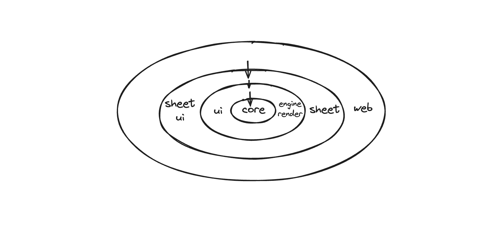

## 零. 开篇

这篇文章旨在帮助新人快速熟悉开源项目 univer 的架构及代码，也是我过去一段时间参与到 univer 开发中的学习和总结，肯定有不够准确或者理解偏差，欢迎大家评论指正

第壹章，会聊聊我对 univer 架构的理解，univer 是如何拆分模块，以及模块之间的依赖关系。然后将 univer 放入 MVC 的架构模式中，分别分析下其模型层、视图层、控制器的边界和职责
第贰章，我们先来看看 univer sheet 的模型层数据结构设计，如何区分 workbook、sheet、row、column、style 等，了解他们的包含关系，这对后面深入理解代码是有帮助的
第叁、肆章，我将从两条控制链路来分析 univer 的代码，一条链路是 univer 启动和初始化渲染的过程。在这条链路中，是从模型层到视图层的过程。另外一条链路是 univer 响应用户事件，并且触发模型层数据变更，页面重新渲染，在这条链路中，是从视图层到模型层的过程。在这两部分，我们会涉及到大量的源码分析，在保留代码主逻辑的前提，删除了边界 case 的代码。同时在每个代码块第一行，表示该代码块所在的 TS 文件，这样便于直接阅读源码

## 壹. 对代码架构的理解

> 外表的美只能取悦于人的眼睛，而内在的美却能感染人的灵魂。 ——伏尔泰

### Univer 中的模块拆分和依赖关系

#### 无依赖环原则

软件架构的规则其实就是排列组合代码块的规则，软件架构会根据业务域来将组织项目代码，将项目拆分成不同的模块，各个模块做到关注点分离，同时模块之间有明确的依赖关系，并且依赖关系是一个单向无环图，也就是无依赖环原则。正如下面图中所示，系统级、应用级业务逻辑是整个项目最核心的部分，同时也是应用最稳定的部分，应该放在架构的最里层，其他如用户界面、渲染引擎、前端框架、持久化的数据库，这些在架构演进的过程中，可能被替换，所以他们都依赖于最中心的业务实体，置于外层



（图注：core、sheet、engine-render、ui、sheet-ui 对应仓库中 packages 下不同文件夹）

Univer 在整个架构设计中，尽量保证核心模块（core）仅包含最核心的业务逻辑，在核心业务逻辑之上所构筑的其他功能，都是通过插件化来提供的，这也是**微内核架构**的思想。在上图中，engine-render、ui、sheet 等都是插件化的，为 core 提供额外的能力。如 sheet 完善 sheet 相关功能，engine-render（canvas 渲染引擎） 提供 canvas 渲染能力，公式引擎提供公式相关的计算和解析等

#### 依赖反转

直观理解，我们可能会认为，core 模块依赖于 engine-render 模块来做 canvas 渲染，依赖 ui 来做页面框架渲染及样式菜单等，ui 又依赖于 React 框架来渲染组件。这样会有一个问题，核心模块依赖于其他模块，其他模块往往是不稳定的，比如样式菜单，我们可能会经常改变位置或者样式，这也有可能导致核心模块易变。在 Univer 中，利用了**依赖反转（Dependency Inversion）**解决上面面临的问题，这也就是上面图中，所有的外面的环都依赖内部的环，而内部的环不能依赖外部环。在 Univer 中引入了**依赖注入（DI）**，通过依赖注入的方式，反转依赖，避免了核心层对外层的依赖，通过下面代码示例来解释会更清晰一些

举个例子，在没有依赖注入，我们可能会写这样的代码：

```ts
class SheetPlugin {
    private _commandService = new CommandService(); 
}
```

在上面代码中，SheetPlugin 类依赖于 CommandService 类，CommandService 类中方法的变更直接会影响到 SheetPlugin，SheetPlugin 可能也需要修改，导致 SheetPlugin 的不稳定


我们通过依赖注入，代码如下：

```ts
class SheetPlugin {
    constructor(
        // ...
        @ICommandService private readonly _commandService: ICommandService,
        // ...
    )

    otherMethod(){
        this._commandService.registerCommand(SomeCommand);
    }
}
```

在上面的代码中，声明了 _commandService 属性拥有 ICommandService 接口，通过相关的依赖绑定，就可以在 SheetPlugin 的方法中调用 ICommandService 接口所定义的方法了。这样 SheetPlugin 依赖于 ICommandService 接口，同时 CommandService 类实现了这个接口。这样就解耦了 SheetPlugin 和 CommandService 之间的直接依赖关系，图示如下：


如上图，我们通过 ICommandService 接口实现依赖反转，在没有 ICommandService 接口下，SheetPlugin 直接依赖于 CommandService，导致核心业务逻辑（SheetPlugin）的不稳定。通过引入 ICommandService 接口，及依赖注入，如果将虚线框看成一个整体，CommandService 类指向（实现接口）虚线框，最终实现依赖反转，保证了核心业务逻辑稳定性

### 浅谈 Univer 中的 MVC 架构模式


MVC 在整个 GUI 编程领域已经有了 50 多年的历史了，但是 MVC 却一直没有一个明确的定义。如上图，就是两种比较典型的 MVC 变种，在 [MVC with ASP.NET](http://asp.net/) 中，控制器负责管理视图和模型，当控制器改变模型层中数据后，通过一些订阅机制，视图层直接读取模型层中数据，更新视图。在 **MVC with Rails** 中，视图层不直接和模型层交互，通过控制器做了一层代理，视图层需要通过控制器从模型层取数据进行渲染。这样有个好处就是视图层和模型层完全的解耦，控制流会更清晰

打开 univer 工程代码，我们可以发现大量以 `controller` 、 `view` 和 `model`后缀命名的文件，大致也能看出其采用了传统的 MVC 架构模式。Univer 中 MVC 架构更类似于 MVC with Rails, 因为视图层不直接读取 Model 层数据，也不订阅模型层的改变（下面会提到，是订阅了 Mutations），而是做了一层数据缓存（类似 ViewModel），SheetSkeleton 类

在最开始看工程代码时，一些疑虑一直萦绕在脑海：

1. Univer 是如何组织和管理模型层的？
2. Univer 中控制器有哪些职责，如何保证控制器代码架构清晰？
3. Univer 的视图层怎么组织和管理的？

阅读源码，谈谈 Univer 如何从架构层面回答上面的问题

#### 模型层（Model）

Univer 的整个模型层会比较薄，拿 univer sheet 来举例，在 core 模块中，通过 Workbook 和 Worksheet 类来管理和 sheet 相关的模型数据，提供了相关模型数据存储和管理的工作。如在 Worksheet 类中，有 row-manager、column-manager、相关的类和方法来管理每个 sheet 模型数据，拿row-manager来说，我们可以获取表格行的一些信息和数据：

```ts
getRowData(): ObjectArray<IRowData>;
getRowHeight(rowPos: number): number;
getRowOrCreate(rowPos: number): IRowData;
// ...
```

很容易理解，我们渲染的数据不能够直接使用底层模型数据，往往需要经过一定的计算，生成一个用于渲染的“模型层”才能用于直接的视图渲染。比如在渲染视图的时候，我们需要计算行、列的总高度。通过每行的文档内容，计算能够容纳数据的最小行高度。通过一系列的计算，最终确定 sheet 页面的布局，用于最终的渲染。而这一系列的计算都放在了视图层 SheetSkeleton 类中

#### 控制器（Controller）的职责


在传统的MVC架构中，视图和模型层往往职责比较明晰，而控制器承担了主要的业务逻辑，和管理视图层、模型层的任务，往往会比较臃肿，那么 univer 是如何避免控制器臃肿的呢？在 Univer 中，控制器（MVC中的控制器）进一步拆解为 **Controllers**（Univer中狭义的控制器）、**Commands** 和 **Services**。同时在控制器中，几乎包含了 univer 所有的业务逻辑，他们各司其职，保证了 univer 应用的正常运行

**Controllers 职责**

- 初始化一些渲染逻辑和事件的监听，如在 SheetRenderController 类中，在应用 Rendered生命周期执行，会去初始化页面的数据刷新（_initialRenderRefresh），会去监听 Commands 的执行，涉及到 Mutation 修改模型层，还会触发页面渲染逻辑
- 和视图层交互，拿到视图层的一些数据信息。如在 AutoHeightController 类中，会根据 Commands 所需，通过视图层计算 sheet 自动行高
- 绑定 UI 事件，如在 HeaderResizeController 类中，会在应用 Rendered生命周期执行，在初始化中，为spreadsheetRowHeader、spreadsheetColumnHeader 绑定 hover 事件，显示和隐藏 resize header（用于调节行列高度和宽度），也为 resize header 绑定 pointer down/move/up 等事件，这样 resize header 就会响应拖拽移动，处理相关用户操作，最终也会反应到模型层的修改和视图层的更新

**Commands 职责**

Commands 可以理解为用户的单次交互操作，比如合并单元格、清除选区、插入行列、设置单元格样式等，并且更改模型层，触发视图层渲染。`Commands` 有三种类型：`COMMAND`、`MUTATION`、`OPERATION`

- **COMMAND** 就是用户的一次交互操作，有用户行为触发，可以派生出另外一个 COMMAND，比如用户点击菜单中 text wrap 菜单项，会触发 `SetTextWrapCommand`，`SetTextWrapCommand` 会派生出 `SetStyleCommand` 统一处理所有样式的更改。一个 `COMMAND` 可以派生另外一个 `COMMAND`，但是不能分叉，因为我们需要在 `COMMAND` 中处理 undo/redo 相关操作（后面 undo/redo 可能会移到数据层）。但是一个 `COMMAND` 可以派生出多个 `MUTATION` 和 `OPERATION`
- **MUTATION** 可以理解为对模型层数据的原子操作，比如 `SetRangeValuesMutation` 修改选区范围内的单元格样式和值，SetWorksheetRowHeightMutation修改选区范围内行的高度。`MUTATION` 的执行，不仅会修改模型数据，同时也会触发视图的重新渲染。MUTATION 中修改的数据需要处理协同，和解决协同中的冲突
- **OPERATION** 是对应用状态的变更，是应用的某个临时状态，如页面滚动位置、用户光标位置、当前的选区等，不涉及到协同和解决冲突的问题，主要用于之后 live share （类似于飞书的 magic share）等功能

**Services 职责**

Services 为整个 Univer 应用提供各种服务，是关注点分离（Separate of concern）在 Univer 项目架构中的承载者

- 管理应用生命周期，如 LifecycleService 类，保存应用生命周期的状态值，并提供 subscribeWithPrevious方法供其他模块订阅应用生命周期状态值的变更，并做响应任务执行，如依赖的初始化等
- 处理应用的 History 操作和存储历史操作，这样用户可以 undo/redo 之前的操作。在 LocalUndoRedoService 类中，通过 `pushUndoRedo` 方法将 undo/redo 信息推入栈中，通过 `updateStatus` 方法触发 undo/redo 操作
- 处理网络 IO 和 websocket 链接

总结一下，将上面 Controllers、Commands、Services 统称为 MVC 中的控制器，他们完成了 univer 中大量业务逻辑，下面列举了其主要职责（在叁、肆部分，会更加详细的分析控制器是如何工作的）：

1. 负责整个应用的生命周期管理
2. 绑定和响应 UI 事件，如双击、光标移动等
3. 控制视图的渲染和触发渲染的逻辑
4. 和视图层通信，如拿计算后页面布局信息
5. 通过 Command/Mutation 改变模型层，触发界面渲染
6. 处理 undo/redo 相关工作
7. 负责协作、和网络 IO

#### 视图层（View）

在 Univer 中，有两种渲染方式：一种是 Canvas 渲染引擎，一种是 React 通过 DOM 进行渲染。Canvas 渲染引擎主要渲染 sheet 的主体部分：行表头、列表头、sheet 单元格、选区、单元格编辑器等。React 主要用于渲染顶部菜单栏、右键菜单栏、浮窗等

Sheet 主体部分选用 Canvas 进行渲染，保证了在大数据量下表格渲染的极致性能体验，和流畅的动画效果。而菜单主要需要响应用户事件，DOM 往往比 Canvas 更具优势

Canvas 渲染所需要的组件、服务都在 `base-render` 文件夹中，如 sheet 渲染相关的：Spreadsheet、SpreadsheetRowHeader、SpreadsheetColumnHeader 等。同时在 Canvas 组件上定义了一套事件响应机制，保证了各个组件能够独立响应事件，但是并不会在视图层处理这些事件。这些事件都需要在 Controllers 中处理

`Base-ui/Components` 文件夹中代码负责菜单基础组件的渲染和用户事件的发布，base-ui 模块也负责整个应用的框架渲染。如在 DesktopUIController 类中，bootstrapWorkbench 启动了整个应用框架渲染，以及 Canvas 元素的挂载等

## 贰. Univer sheet 数据结构

了解一个项目，先从其数据结构开始

Sheet 相关的数据类型定义在 [Interfaces](https://github.com/dream-num/univer/tree/dev/packages/core/src/Types/Interfaces) 文件夹中，包含关系如下：


Univer sheet 整体的数据类型定义如上图所示，一个 workbook 包含多个 sheets，sheets 所引用的 styles 字段定义在了顶层 workbook 上，保证了样式的复用，减少内存开销，这也是和 Excel 保持一致。在 IWorksheetConfig 中，定义了 cellData 字段，这是一个二维矩阵，用于持久化单元格信息，也就是 ICellData 中定义的类型信息，**p 是指富文本，接口类型 IDocumentData，也就是一篇 univer doc，这也是 univer 设计的独到之处，univer sheet 的每个单元格都可以转变成一个 univer doc**。s 字段大多是一个字符串 id，指向 IWorkbookConfig 中 styles 字段，从中检索出该单元格的样式信息

图中并没有包含各个接口定义的所有字段，想了解更多，建议直接查看上面的[类型定义文件](https://github.com/dream-num/univer/blob/9a505ec3ba9de96677b9caaa821e287e71ebe0cf/packages/core/src/Types/Interfaces/IWorkbookData.ts#L12)，上面也有相应注释

## 叁. 应用启动到渲染的过程

Univer 如何渲染页面，其实就是 univer 应用启动的整个过程，也是模型层到视图层的整个过程。在了解页面渲染前，我们先了解下 univer 的生命周期，其实在上面 Services 部分也有所提及

### 应用的生命周期

```ts
export const enum LifecycleStages {
    /**
     * Register plugins to Univer.
     */
    Starting,
    /**
     * Univer business instances (UniverDoc / UniverSheet / UniverSlide) are created and services or controllers provided by
     * plugins get initialized. The application is ready to do the first-time rendering.
     */
    Ready,
    /**
     * First-time rendering is completed.
     */
    Rendered,
    /**
     * All lazy tasks are completed. The application is fully ready to provide features to users.
     */
    Steady,
}
```

Univer 生命周期有四个阶段，`Starting`、`Ready`、`Rendered` 和 `Steady`。如在 Starting 阶段去注册各个插件到 univer 上面，在 Ready 阶段实例化 UniverSheet，并且执行各个插件的初始化函数，Rendered 阶段完成首次渲染，Steady 阶段，应用完成启动，用户可以使用完整功能

各个生命周期状态在什么时候触发呢？

**Starting 状态**：在 _tryStart方法中，LifecycleService 类实例化，应用进入 Staring 阶段，**在这个阶段也会去执行插件的 onStarting 钩子函数**

**Ready 状态**：在实例化 UniverSheet 后，在 _tryProgressToReady方法中，设置 LifecycleService stage 值为 Ready，**在这个阶段也会执行各个插件的 onReady 钩子函数**

**Rendered 状态**：在 DesktopUIController 中，bootStrap 整个应用后，标记 LifecycleService stage 值为 Rendered

**Steady 状态**：在 Rendered 状态后，延迟 3000 秒触发 Steady 状态

通过 @OnLifecycle 注解，我们可以精确控制某个类在什么生命周期阶段实例化，如下：

```ts
@OnLifecycle(LifecycleStages.Rendered, SheetRenderController)
export class SheetRenderController extends Disposable {
    //...
}
```

在上面代码中，SheetRenderController 将在 Rendered 阶段实例化

启动到渲染的整个过程


第一步：创建 Univer 实例、注册 sheet 所需的相关插件和创建 univer sheet 实例

注册的插件及相关功能如下：

- base-docs：用于单元格和公式的编辑
- base-render：Canvas 渲染引擎，也包含 sheet、doc、slide 所需的基础组件，负责 Canvas 渲染整个过程
- base-sheets：管理 sheet canvas 相关的渲染，如 row header、column header、单元格等，同时也处理大量sheet相关业务逻辑
- base-ui：管理 React DOM 渲染的基础组件，如菜单相关的组件。同时也负责整个 univer sheet 页面框架的渲染，以及和用户交互的操作都会放在这个插件中，如快捷键注册、复制、剪切黏贴等
- ui-plugin-sheets：负责一些基础 UI 的渲染和业务逻辑，如右键菜单、单元格富文本编辑相关的任务

插件注册完成，通过 createUniverSheet 方法，创建 univer sheet 实例

```ts
/**
 * Create a univer sheet instance with internal dependency injection.
 */
createUniverSheet(config: Partial<IWorkbookConfig>): Workbook {
    let workbook: Workbook;
    const addSheet = () => {
        workbook = this._univerSheet!.createSheet(config);
        this._currentUniverService.addSheet(workbook);
    };

    if (!this._univerSheet) {
        this._univerSheet = this._rootInjector.createInstance(UniverSheet);

        this._univerPluginRegistry
            .getRegisterPlugins(PluginType.Sheet)
            .forEach((p) => this._univerSheet!.addPlugin(p.plugin as unknown as PluginCtor<any>, p.options));
        this._tryStart();
        this._univerSheet.init();
        addSheet();

        this._tryProgressToReady();
    } else {
        addSheet();
    }

    return workbook!;
 }
```

通过上面代码，我们可以看到，univer 将上面注册的插件中 PluginType.Sheet 类型的插件，重新注册到了 univerSheet 实例上，然后通过 _tryStart 应用进入 Starting 阶段，然后初始化，通过 addSheet 实例化 Workbook，完成了模型层的初始化。到这里模型数据准备完毕，univer 进入到 Ready 阶段

**第二步**：初始化页面框架，渲染页面框架
在上面讲述 Univer 应用生命周期时，提到过插件会在 univer 不同的生命周期执行，在这一步，我们重点关注 base-ui 插件

```ts
// base-ui-plugin.ts
override onStarting(_injector: Injector): void {
    this._initDependencies(_injector);
}

override onReady(): void {
    his._initUI();
}
```

如上代码，base-ui 插件在 onStarting 阶段会去声明和添加依赖，在 onReady 阶段，会去初始化渲染整个页面框架，将 View 界面挂载到 container 上。

```ts
// ui-desktop.controller.tsx
bootstrapWorkbench(options: IWorkbenchOptions): void {
    this.disposeWithMe(
        bootStrap(this._injector, options, (canvasElement, containerElement) => {
            this._initializeEngine(canvasElement);
            this._lifecycleService.stage = LifecycleStages.Rendered;
            this._focusService.setContainerElement(containerElement);

            setTimeout(() => (this._lifecycleService.stage = LifecycleStages.Steady), STEADY_TIMEOUT);
        })
    );
}
// ...
function bootStrap(
    injector: Injector,
    options: IWorkbenchOptions,
    callback: (canvasEl: HTMLElement, containerElement: HTMLElement) => void
): IDisposable {
    let mountContainer: HTMLElement;
    // ...
    const root = createRoot(mountContainer);
    const ConnectedApp = connectInjector(App, injector);
    const desktopUIController = injector.get(IUIController) as IDesktopUIController;
    const onRendered = (canvasElement: HTMLElement) => callback(canvasElement, mountContainer);

    function render() {
        const headerComponents = desktopUIController.getHeaderComponents();
        const contentComponents = desktopUIController.getContentComponents();
        const footerComponents = desktopUIController.getFooterComponents();
        const sidebarComponents = desktopUIController.getSidebarComponents();
        root.render(
            <ConnectedApp
                {...options}
                headerComponents={headerComponents}
                contentComponents={contentComponents}
                onRendered={onRendered}
                footerComponents={footerComponents}
                sidebarComponents={sidebarComponents}
            />
        );
    }

    // ...
    render();
    // ...
}
```

在上面代码可以看到，在页面框架挂载并渲染完成后，会去完成 canvas 渲染引擎容器挂载及调整 canvas 尺寸，整个应用进入 Rendered 阶段

**第三步**：渲染 canvas 界面，完成整个渲染过程

其实这个过程在应用 Ready 阶段就已经开始了 sheet canvas 的初始化和组件组装和添加

```ts
// sheet-canvas-view.ts
@OnLifecycle(LifecycleStages.Ready, SheetCanvasView)
export class SheetCanvasView {
    // ...
    constructor(
        // ...
    ) {
        this._currentUniverService.currentSheet$.subscribe((workbook) => {
            // ...
            const unitId = workbook.getUnitId();
            if (!this._loadedMap.has(unitId)) {
                this._currentWorkbook = workbook;
                this._addNewRender();
                this._loadedMap.add(unitId);
            }
        });
    }

    private _addNewRender() {
        // ...
        if (currentRender != null) {
            this._addComponent(currentRender);
        }
        const should = workbook.getShouldRenderLoopImmediately();
        if (should && !isAddedToExistedScene) {
            engine.runRenderLoop(() => {
                scene.render();
            });
        }
        // ...
    }

    private _addComponent(currentRender: IRender) {
        // ...
        currentRender.mainComponent = spreadsheet;
        currentRender.components.set(SHEET_VIEW_KEY.MAIN, spreadsheet);
        currentRender.components.set(SHEET_VIEW_KEY.ROW, spreadsheetRowHeader);
        currentRender.components.set(SHEET_VIEW_KEY.COLUMN, spreadsheetColumnHeader);
        currentRender.components.set(SHEET_VIEW_KEY.LEFT_TOP, SpreadsheetLeftTopPlaceholder);
        // ...
        this._sheetSkeletonManagerService.setCurrent({ sheetId, unitId });
    }

    private _addViewport(worksheet: Worksheet) {
        // ...
        scene
            .addViewport(
                viewMain,
                viewColumnLeft,
                viewColumnRight,
                viewRowTop,
                viewRowBottom,
                viewLeftTop,
                viewMainLeftTop,
                viewMainLeft,
                viewMainTop
            )
            .attachControl();
    }
}
```

上面代码，其实就是 sheet canvas 渲染的整个过程，首先会去订阅`currentSheet$`，如果该 sheet 没有被render 过，那么就会调用 `_addNewRender` 方法，添加 sheet 所需的 canvas 渲染组件，添加 viewport，然后将 scene 的渲染添加到渲染引擎的渲染循环中（runRenderLoop）

在上面过程，完成了 sheet 所需 canvas 组件的组装以及添加 viewport，那么 canvas 的首次渲染发生在什么地方呢？和什么生命周期阶段呢？sheet canvas 的渲染被 SheetRenderController 类所管理，该类管理了 sheet canvas 的初始化渲染以及监听 Mutations 的变更，然后按需渲染 Canvas 界面

```ts
// sheet-render.controller.ts
@OnLifecycle(LifecycleStages.Rendered, SheetRenderController)
export class SheetRenderController extends Disposable {}
```

上面的代码可以看到，sheet canvas 的渲染时间点是在整个应用 Rendered 阶段，其实也好理解，这个阶段，页面框架才完成挂载到 container 上，同时 sheet canvas 也完成了初始化工作。在 Rendered 阶段，会去订阅 currentSkeleton$ 改变，然后去更新 skeleton，完成页面首次渲染。

```ts
// sheet-render.controller.ts
private _commandExecutedListener() {
    this.disposeWithMe(
         his._commandService.onCommandExecuted((command: ICommandInfo) => {
            // ...
            if (COMMAND_LISTENER_SKELETON_CHANGE.includes(command.id)) {
                // ...
                if (command.id !== SetWorksheetActivateMutation.id) {
                    this._sheetSkeletonManagerService.makeDirty(
                        {
                            unitId,
                            sheetId,
                            commandId: command.id,
                         ,
                        true
                    );
                }

                 this._sheetSkeletonManagerService.setCurrent({
                    unitId,
                    sheetId,
                    commandId: command.id,
                });
           }

            this._renderManagerService.getRenderById(unitId)?.mainComponent?.makeDirty(); // refresh spreadsheet
        })
    );
}
```

上面代码发生在 SheetRenderController 类，在 _commandExecutedListener 方法中，会去监听 Command 执行，如果在 `COMMAND_LISTENER_SKELETON_CHANGE` 列表内，标记当前 skeleton 为 dirty，mainComponent 为 dirty，这样 Canvas 渲染引擎就会在下个渲染循环中重新渲染页面了

**第四步**：单元格编辑器初始化

其实在第三步，基本已经完成了整个 sheet 界面的渲染，我们再来关注一下单元格编辑器的初始化过程。在应用 Rendered 阶段，univer 会去初始化两个 Doc 实例，一个用于单元格的编辑，另一个用于公式输入框的编辑。

```ts
// initialize-editor.controller.ts
private _initialize() {
    this._currentUniverService.createDoc({
        id: DOCS_NORMAL_EDITOR_UNIT_ID_KEY,
        documentStyle: {},
    });
    // create univer doc formula bar editor instance

    this._currentUniverService.createDoc({
        id: DOCS_FORMULA_BAR_EDITOR_UNIT_ID_KEY,
        documentStyle: {},
    });
}
```

同样在 Rendered 阶段，EditorBridgeController 类实例化时，会去初始化相关的事件监听，如双击单元格，单元格进入编辑模式。但是直到 Steady 阶段，StartEditController 类才完成实例化，单元格编辑才能完全可交互

## 肆. 界面如何响应用户操作？

下面的时序图描述了当用户点击 text wrap 菜单项，univer 从响应事件到界面渲染的整个过程


**第一步**：用户点击菜单中 text wrap 菜单项。

```ts
 // menu.ts
 export function WrapTextMenuItemFactory(accessor: IAccessor): IMenuSelectorItem<WrapStrategy> {
    // ...
    return {
        id: SetTextWrapCommand.id,
        // ...
    };
}
// ToolbarItem.tsx
 <Select
    // ...
    onClick={(value) => {
        let commandId = id;
        // ...
        commandService.executeCommand(commandId, value);
     }}
     // ...
 />
```

上面是菜单栏中 text wrap 菜单项的 Select 组件，可以看到在上面绑定了 click 事件处理函数，当点击后，commandService 将执行 commandId，也就是在 WrapTextMenuItemFactory 中配置的 id 值：SetTextWrapCommand 的 id

**第二步**：在 SetTextWrapCommand 中，包装一下参数，然后执行了统一设置样式的 Command，SetStyleCommand

```ts
export const SetTextWrapCommand: ICommand<ISetTextWrapCommandParams> = {
    type: CommandType.COMMAND,
    id: 'sheet.command.set-text-wrap',
    handler: async (accessor, params) => {
        // ...
        const commandService = accessor.get(ICommandService);
        const setStyleParams: ISetStyleParams<WrapStrategy> = {
            style: {
                type: 'tb',
                value: params.value,
            },
        };

        return commandService.executeCommand(SetStyleCommand.id, setStyleParams);
    },
};
```

**第三步**：在 SetStyleCommand 中，因为改变了选区内样式值，所以需要组装 SetRangeValuesMutation 的参数，比如将选区内所有单元格的 tb 设置为 WrapStrategy.WRAP。由于选区内 text wrap 的改变，同时该行是自动调整行高的，那么还需要去计算该行的一个 autoHeight，也就是容纳该行内容的一个最低高度。计算自动行高之前，需要先执行 SetRangeValuesMutation，因为 autoHeight 计算是依赖于更新后的视图数据的。 通过 SheetInterceptorService 中注册的 interceptor 拿到 autoHeight 的值（redos 中）

```ts
 // set-style.command.ts
 const { undos, redos } = accessor.get(SheetInterceptorService).onCommandExecute({
       id: SetStyleCommand.id,
        params,
 });
```

**第四步**：之所以上面能够拿到 autoHeight 的值，主要还是归因于 AutoHeightController 类，该类在 LifecycleStages.Ready 阶段被实例化，并且添加了会影响到行自动行高的所有 Command 的拦截，如对 SetStylecommand 拦截。

```ts
// auto-height.controller.ts
// for intercept set style command.
sheetInterceptorService.interceptCommand({
     getMutations: (command: { id: string; params: ISetStyleParams<number> }) => {
          if (command.id !== SetStyleCommand.id) {
              return {
                  redos: [],
                  undos: [],
              };
          }
          // ...
          const selections = selectionManagerService.getSelectionRanges();

          return this._getUndoRedoParamsOfAutoHeight(selections);
      },
  });
```

第五步：因为计算行的自动行高需要用到文档模型以及单元格布局的相关计算，所相关计算都放在了管理Spreadsheet 的 SheetSkeleton 类中(视图层)， 通过该类中 calculateAutoHeightInRange 方法最终计算出行的自动行高

```ts
// auto-height.controller.ts
private _getUndoRedoParamsOfAutoHeight(ranges: IRange[]) {
    // ...
    const { skeleton } = sheetSkeletonService.getCurrent()!;
    const rowsAutoHeightInfo = skeleton.calculateAutoHeightInRange(ranges);
    // ...     
}
```

**第六步**：当拿到 autoHeight 的数据后，会触发 SetWorksheetRowHeightMutation。无论是上面触发的 SetRangeValuesMutation 还是 SetWorksheetRowHeightMutation，都会更改模型层，并且标记 sheetSkeleton 和 mainComponent 为 dirty，在 sheetSkeletion 重新计算布局等相关渲染所需信息，然后渲染页面

```ts
// sheet-render.controller.ts
private _commandExecutedListener() {
    this.disposeWithMe(
        this._commandService.onCommandExecuted((command: ICommandInfo) => {
            // ...
            if (COMMAND_LISTENER_SKELETON_CHANGE.includes(command.id)) {
                 // ...
                 if (command.id !== SetWorksheetActivateMutation.id) {
                    this._sheetSkeletonManagerService.makeDirty(
                        {
                            unitId,
                            sheetId,
                            commandId: command.id,
                        },
                        true
                    );
                  }
                  // ...
              }
              this._renderManagerService.getRenderById(unitId)?.mainComponent?.makeDirty(); // refresh spreadsheet
         })
     );
 }
```

以上就完成了从事件触发到修改模型层，进而视图层更新的整个过程

## 伍. 更多阅读

如果你想对架构有个整体的了解，推荐阅读[Architecture Notes 架构概要](https://github.com/dream-num/univer/blob/dev/docs/zh/achitecture.md#architecture-notes-%E6%9E%B6%E6%9E%84%E6%A6%82%E8%A6%81)，如果你想了解更多 sheet 的架构和各个模块的设计和职责，推荐阅读[Univer Sheet Architecture - Univer Sheet 架构](https://github.com/dream-num/univer/blob/dev/docs/zh/sheet-architecture.md#univer-sheet-architecture---univer-sheet-%E6%9E%B6%E6%9E%84)。如果你对 DI 系统比较陌生，建议 阅读 Univer 项目中所使用的 DI 框架 [redi](https://redi.wendell.fun/zh-CN/docs/introduction)。项目使用 Rxjs 作为观察者模式，阅读 [Rxjs 相关文档](https://rxjs.tech/guide/overview) 是快速熟悉 Rxjs 的方式

<p style="color: #666; font-size: 14px;">作者：<a href="https://github.com/Jocs">Jocs</a>， <a href="https://github.com/marktext/marktext">MarkText</a> 作者，Univer 核心开发者，负责 Univer Doc 架构及开发</p>
