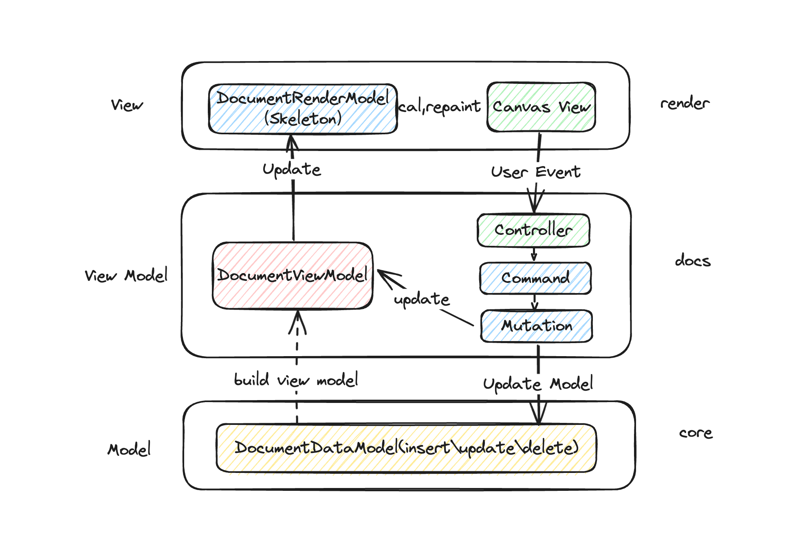
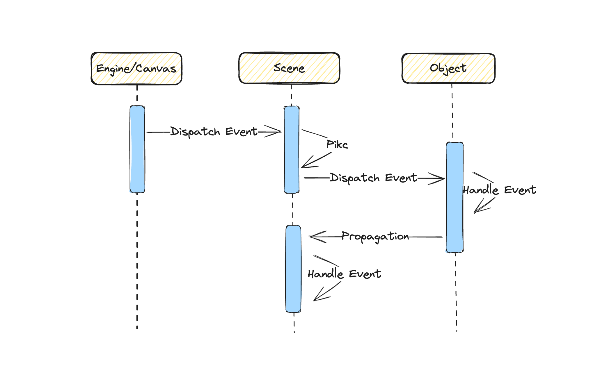
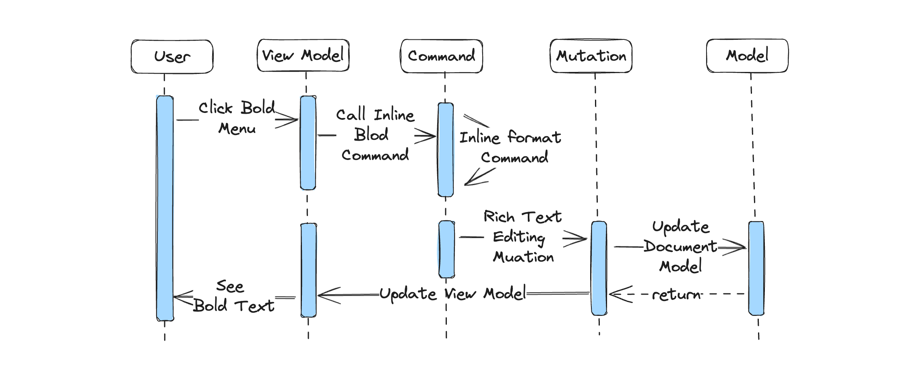

## 1. Univer 文档项目架构

Univer 文档是 Univer 办公套件之一，旨在提供一流的文档编辑和排版体验，我们不仅在产品形态上的融合，通过无界模式来减少在不同套件之间的切换开销，同时让数据在不同套件之间联通。在技术架构上，我们也尽量通过一套架构来实现，既保证了开发体验的高效，同时也为产品形态的融合提供更多的想象空间

>如果你对 Univer 架构还比较陌生，建议先阅读《[Univer 架构](https://univer.ai/guides/architecture/architecture/)》、《[这就是 Univer](https://zhuanlan.zhihu.com/p/666298812)》，在这两篇文章中有关于 Univer 整体架构的描述，Univer 中的命令系统、底层数据模型、渲染引擎等介绍，同时也分析了从数据层到视图层渲染，从视图层事件响应到数据层数据更新的整个过程

本篇文章主要聚焦在 Univer 文档的技术架构和模块设计，我们先从一张架构图开始：

### 1.1 项目架构图



由上面架构图大致可以看出，Univer 文档整体符合 MVVM 的架构模型。自下而上分别是数据模型层、视图模型层、视图层。整个文档项目拆分成 3 层多个模块：

1. 数据模型层，主要由 DocumentDataModel 类进行数据模型的管理，以及数据的更新
2. 视图模型层，包含了视图模型，视图模型通过底层数据模型构建，主要用于视图的渲染，同时在视图模型层中还包含了命令系统，比如响应视图层事件，进而触发视图模型和数据模型的更新
3. 视图层，在视图层主要完成两件事情，第一件事情，通过视图模型层的数据进行布局计算，也就是所谓的排版，这一步发生在 DocumentRenderModel（Document Skeleton） 中，主要完成页面内容样式布局计算。第二件事情，将布局计算的结果，通过渲染引擎渲染到页面上

在接下来几个小节中，我将更加详细的描述不同层的数据结构、职责及功能

### 1.2 数据模型层

#### 1.2.1 文档模型层数据结构

文档的数据结构如下：

```typescript
// i-document-data.ts
export interface IDocumentData extends IReferenceSource, IExtraModelData {
    /** unit ID */
    id: string;
    title?: string;
    body?: IDocumentBody;
    documentStyle: IDocumentStyle;
    // ...
}
export interface IDocumentBody {
    dataStream: string;
    textRuns?: ITextRun[]; // textRun 样式，交互
    paragraphs?: IParagraph[]; // paragraph
    sectionBreaks?: ISectionBreak[]; // SectionBreak
    customBlocks?: ICustomBlock[]; // customBlock 用户通过插件自定义的block
    tables?: ITable[]; // Table
    customRanges?: ICustomRange[]; // plugin注册，实现针对stream的特殊逻辑，超链接，field，structured document tags， bookmark，comment
}
```

文档的数据结构定义主要在 IDocumentData 和 IDocumentBody 两个接口中，在 IDocumentData 中包括文档的标题、id、body、样式等信息，而 IDocumentBody 接口定义了文档内容的所有信息

- dataStream 是一个字符串类型，就是我们文档的文本内容
- textRuns 中定义了文档的行内样式，比如粗体、斜体、颜色、背景色、字体、字体大小等，它通过 st 和 ed 两个位置索引，来标识行内样式应用到文档的内容范围
- paragraphs 字段包含了段落信息，包括段落的开始位置以及段落的样式，比如悬挂、缩进以及列表样式等。在 Univer 文档中，paragraph 通过 \r在 dataStream 进行占位
- sectionBreaks 字段包含了节相关信息，section 通过 `\n` 在 dataStream 中进行占位，所以在 dataStream 中遇到 `\n` 也就标识这是一个节的结束，所有的 univer 文档都需要以 `\r\n` 结尾
- customBlocks 字段包含用户自定义的 block
- tables 字段包含表格相关的信息
- customRanges 字段包括可重叠的文档信息，比如评论、超链接等

```ts
export const DEFAULT_DOCUMENT_DATA_SIMPLE: IDocumentData = {
    id: 'default-document-id',
    body: {
        dataStream: '荷塘月色\r作者：朱自清\r\n',
        textRuns: [
            {
                st: 0,
                ed: 4,
                ts: {
                    fs: 24,
                    ff: 'Microsoft YaHei',
                    bl: BooleanNumber.TRUE,
                },
            },
        ],
        paragraphs: [
            {
                startIndex: 4,
                paragraphStyle: { /*...*/ },
            },
            {
                startIndex: 11,
            },
        ],
        sectionBreaks: [
            {
                startIndex: 12,
            },
        ],
    },
    documentStyle: { /*...*/ },
};
```

上面是一个简单的文档示例，整个文档包含两个段落一个 section，在 dataStream 中有两个 `\r` 进行段落占位，一个 `\n` 进行 section 占位，textRuns 中包含一条行内样式，对正文 `st:0 ~ ed:4` 范围内的文字加粗，并且字体大小是24号，字体微软雅黑

#### 1.2.2 管理数据模型的类

数据模型是通过 `DocumentDataModel` 类来进行管理的，该类位于 core 模块中，数据模型的修改需要通过 mutation 来变更，通过应用 `DocumentDataModel` 上的 apply 方法，将 mutaitons 应用到数据模型上，最终达到修改底层数据的目的

在文档中，mutation 抽象成了 3 中类型，`retain`、`insert` 和 `delete`，`retain` 操作可以理解过移动光标或者应用样式修改，`insert` 操作是插入文档内容，插入的内容可以包含样式（textRuns），`delete` 操作是删除文档内容，只需要传入 `len` 属性就行，表示需要删除的长度

由于文档需要支持历史栈，即通过 undo 和 redo 来回到之前的文档状态，所以以上三种操作还需要支持 invert 操作，即他们的反向操作，如 insert 的反向操作是 delete，delete 的反向操作是 insert，同时由于还需要支持多人协作等，所以我们还需要对 mutation 进行 transform 和 compose 操作，关于这部分内容，后面会有相关文章来介绍文档协作编辑，由于篇幅所限，这儿就不再赘述

### 1.3 视图模型层

在视图模型层，主要涉及到 DocumentViewModel 和 DocmentSkeleton 的管理，以及文档的控制器、Services 和命令系统

#### 1.3.1 View Model 管理

DocumentViewModel 类的定义是在 engine-render 模块中，其实也不难理解，因为 View Model 的主要职责也就是为渲染（视图渲染层）服务，所以相关接口和类也就定义在了 engine-render 模块中，DocumentViewModel 实例的管理是在 docs 模块中进行，对于代码在 doc-view-model-manager.service.ts 文件中

DocumentViewModel 的主要职责就是根据最新的 DocumentDataModel 生成最新的 View Model，然后供 Document Skeleton（后面会介绍到） 消费，那为什么还需要一个专门的 service 来进行管理呢，而非单实例的呢？正如前文所描述，Univer 并非只包含文档，它也包含表格、演示文稿等，在表格中，它的单元格编辑器以及公式栏编辑器都是一个文档编辑器，也就是说任意一个表格单元格也是通过文档来管理和渲染的，同时 Univer 也支持多实例，所以我们需要通过 service 来进行 View Model 的管理

一篇文档对应一个 DocumentViewModel 实例，当监听到有文档创建或更新时，docViewModelManagerService 会去创建或者更新文档 view model，使其保持最新状态，以供对应的 Document Skeleton 消费使用

```ts
// doc-canvas-view.ts
private _initialize() {
    this._currentUniverService.currentDoc$.pipe(takeUntil(this.dispose$)).subscribe((documentModel) => {
        const unitId = documentModel.getUnitId();
        // Build the view model and notify the skeleton manager to create the skeleton.
        this._docViewModelManagerService.setCurrent(unitId);

        // ...
    });
}
```

正如以上代码，监听到 Doc 新增或者修改，都会调用 docViewModelManagerService 上的 setCurrent 方法，对 view model 进行更新

#### 1.3.2 Document Skeleton 的管理

上面也提到，视图模型层不仅管理 view model，同时也管理 DocumentSkeleton，也就是文档布局相关的信息，相关代码在 doc-skeleton-manager.service.ts 文件中（在《Univer 文档排版设计》文章中，将更加详尽介绍 Document Skeleton），和 view model 一样，一篇 Univer 文档对应一份 Document Skeleton 实例，通过唯一的 `unitId` 和 `subUnitId` 来唯一标识，当监听到 view model 更新后，对应的 skeleton 实例也需要进行创建或者更新

```ts
// doc-skeleton-manager.service.ts
private _setCurrent(docViewModelParam: IDocumentViewModelManagerParam): Nullable<IDocSkeletonManagerParam> {
        const { unitId } = docViewModelParam;

        if (!this._docSkeletonMap.has(unitId)) {
            const skeleton = this._buildSkeleton(docViewModelParam.docViewModel);

            skeleton.calculate();

            this._docSkeletonMap.set(unitId, {
                unitId,
                skeleton,
                dirty: false,
            });
        } else {
            const skeletonParam = this.getSkeletonByUnitId(unitId)!;
            skeletonParam.skeleton.calculate();
            skeletonParam.dirty = true;
        }

        // ...
        this._currentSkeleton$.next(this.getCurrent());
        return this.getCurrent();
}
```

如上代码所示，当监听到 view model 变更后，会调用 _setCurrent 方法，通过最近的 view model 来创建或者更新 skeleton

#### 1.3.3 控制器和命令系统

在视图层中，还包括控制器、Services 和命令系统相关的代码，控制器主要用来控制编辑器响应视图层发出的事件，以及处理页面初始渲染相关事宜，比如：

- Clipboard Controller: 处理剪切板相关的工作，如富文本的复制、剪切和黏贴
- Inline Format Controller：处理行内样式相关的工作，如对文本进行加粗、斜体改变颜色等
- Text Selection Controller：监听视图层事件，处理双击、三击、以及绘制选区相关的工作，由于 Univer 是支持多实例的，一个 Univer 实例中可能存在多个 Doc 实例，所以该控制器也负责切换选区绘制的运行时等
- 
Service 服务，其实在上文中已经提到了视图模型层中两个重量级的服务了，View Model Manager Service 和 Doc Skeleton Manager Service，分别用来管理 view model 和 doc skeleton。其实还包含其他一些 Service：
- Clipboard Service：剪切板相关的服务，主要提供获取剪切板内容，并将剪切板内容转为 Univer 所需格式，设置剪切板内容，将 Univer 文档格式转为剪切板所需格式等服务
- Text Selection Manager Service：可以将该服务视为底层 Text Selection Render Manager 的一个上层服务，**在开发业务时，我们会尽量避免直接调用底层 Text Selection Render Manager 中的方法，而应该使用 Text Selection Manager 提供的方法**，比如刷新选区、获取所有选区以及替换（设置）选区等，最常用的 getSeletions 获取所有选区，getActiveRange 获取活跃选区
- ...

命令系统，在命令系统中，处理了大量的业务逻辑，几乎所有的业务逻辑都在命令系统中找到它们的身影，在《这就是 Univer》中也提到，命令主要有 3 中类型：command、mutation 和 operation，command 可以理解为用户的某次操作行为，如创建段落、通过 Backspace 键删除光标前的文字或者选区的内容等，Command 会去触发 mutation 来达到数据模型的修改，同时也会去修改视图模型，触发 Skeleton 重新计算，最终反应到视图层的修改，不涉及到协同的操作会放到 operation 中，如光标和选区的变化，通过 live share 同步到其他用户端

- Break Line Command：监听 Enter 键盘事件，创建新的段落
- IME Input Command：处理输入法事件，进行文本输入
- Inline Format Command：所有行内样式的 Command，如通过菜单对文本进行加粗、斜体改变颜色等
- ...

## 1.4 视图层

视图层位于整个项目架构的最顶层，也是和用户直接交互的地方，视图层相关代码位于 engine-render 模块中。将文档内容通过 Canvas 渲染到页面中，这样用户就可以看到文档的文字、图片内容等，同时视图层也负责接收并触发用户键盘和鼠标事件，比如用户通过键盘输入文字内容，我们应该及时更新数据及界面渲染内容，所输及所得。在这部分，我们将重点介绍视图层中两个核心模块：**事件系统**、**选区光标**，熟悉这两个模块也就对文档视图层有了基本的映像

> 视图层还涉及到 Document Skeleton 和文档排版设计，后面会有单独一篇文章《Univer 文档排版设计》来介绍，这儿就不赘述了

#### 1.4.1 事件系统

在了解事件系统前，我们需要对渲染引擎的架构有所了解，欢迎阅读《[渲染引擎架构设计](https://univer.ai/guides/architecture/renderer/)》，里面有关于渲染引擎的设计，在这篇文章中，介绍了如何在一个渲染引擎下，进行表格、文档、演示文稿的绘制和渲染，以及分层渲染、Viewport 设计以及贴图渲染，对渲染引擎有个大致了解后，我们来聊聊 Univer 中的事件系统

在 DOM 的事件系统中，我们可以单独为某一个元素（如 DIV）绑定事件，事件在没有阻止冒泡的前提下，该事件会向父级元素冒泡，也就是该事件绑定元素祖先元素也能接受到该事件，最终会冒泡到 document 元素上，我们通过事件代理可以在祖先元素上绑定一次事件，然后监听不同的触发元素。但是在 Canvas 中，只有一个 Canvas 元素，我们怎么进行事件绑定呢？事件又是如何分发到各个 Canvas 绘制的 Object 上的呢？

在渲染引擎的事件系统中，我们借鉴了 DOM 的事件派发和处理系统，一句话解释下渲染引擎的事件系统：

>我们对 Canvas Element 元素绑定各种事件，如 mouseenter、mousemove、mouseleave 等，然后对事件对象进行包装，然后通过当前鼠标位置信息，找到最上层的 Canvas 绘制的 Object，然后触发该 Object 上的绑定的对应事件，如果没有阻止事件冒泡，那么该事件将继续往上传递，最终传递到 Scene 上，如果 Scene 上也有对应的事件处理函数，也会被执行

哈，上面不止一句话了，下面我将从源码层面来详细解释 Univer 渲染引擎中的事件系统



第一步：在 Canvas 元素上绑定事件，并对事件对象进行包装

```ts
// engine.ts
this._pointerDownEvent = (nativeEvent: Event) => {
     const evt = nativeEvent as IPointerEvent;
     if (deviceType === DeviceType.Mouse) {
          if (!document.pointerLockElement) {
              this._canvasEle.setPointerCapture(this._mouseId);
          }
     } else {
          // Touch; Since touches are dynamically assigned, only set capture if we have an id
          if (evt.pointerId && !document.pointerLockElement) {
              this._canvasEle.setPointerCapture(evt.pointerId);
          }
     }

     // ...
     this.onInputChangedObservable.notifyObservers(deviceEvent);
 };
this._canvasEle.addEventListener(`${eventPrefix}down`, this._pointerDownEvent);
```

如上代码，在 canvasEle 上绑定 pointerdown 事件，在  _pointerDownEvent 函数中，对事件对象进行相应包装，然后通过 onInputChangedObservable 将事件抛出，传递给 Scene 处理。在上面的代码中，有个需要注意的地方，我们对 canvasEle 进行 setPointerCapture，该方法将制定 canvasEle 为未来指针事件的捕获目标，指针的后续事件都将以捕获元素为目标，直到捕获被释放（[Element.releasePointerCapture()](https://developer.mozilla.org/en-US/docs/Web/API/Element/releasePointerCapture) ），这样保证了 pointerup 也在该元素上触发

第二步：将事件对象传递给 Scene，并调用对应的事件处理函数

```ts
// scene.input-manager.ts
this._onInputObserver = engine.onInputChangedObservable.add((eventData: IEvent) => {
    // ...
    this._onPointerDown(evt as IPointerEvent);
});
this._onPointerDown = (evt: IPointerEvent) => {
     const currentObject = this._getCurrentObject(evt.offsetX, evt.offsetY);

     const isStop = currentObject?.triggerPointerDown(evt);

     if (this._checkDirectSceneEventTrigger(!isStop, currentObject)) {
         if (this._scene.onPointerDownObserver.hasObservers()) {
              this._scene.onPointerDownObserver.notifyObservers(evt);
         }
     }
};
```

如上代码，首先为 onInputChangedObservable 添加 pointerdown 事件处理函数，在 _onPointerDown 事件处理函数中，通过当前 evt 的坐标信息找到最上层的 Object，触发该 Object 上的 PointerDown 事件处理函数，如果事件没有被阻止，将继续冒泡

第三步：冒泡到最顶层，触发 Scene 上的事件处理函数

上面源码删除了实现细节和边界 case，欢迎直接阅读相关源码，了解更多细节，比如如何通过指针坐标找到最上层的 Object？如何阻止事件冒泡？为什么 Scene 上也可以绑定事件？

#### 1.4.2 选区及光标介绍

**选区及光标可以说是富文本编辑器中与业务逻辑直接相关的最核心的模块**，因为几乎所有的业务逻辑，第一步都是先获取当前光标和选区，然后在实现对应的业务逻辑，在文章第二部分，我们有比较详尽的用例介绍

和 DOM contenteditable 实现的富文本编辑器有所不同，通过 Canvas 实现的富文本编辑器，光标和选区都需要自己实现，不能够使用浏览器提供的选区对象，但是这样也有个好处，我们可以高度定制化，比如在主流浏览器中，不支持多 Range（仅 firefox 支持），也就是不支持同时设置多个选区，但是如果通过 Canvas 来实现选区，那么我们就可以对选区进行高度定制，比如多选区的支持，选区的大小、颜色、闪烁动画等

还是一句话来描述下自定义选区是如何实现的：

>我们会在 Document（渲染引擎中的 Document 对象，而非 DOM 中的 document 对象） 对象上，监听 pointerdown、pointermove 和 pointerup 等事件，根据相关事件的位置信息，我们会通过 TextRange 对象来绘制矩形的选区或者光标

那么问题来了，我们如何描述选区和定位选区位置呢？选区上又有哪些属性呢？

选区属性及方法定义都在 TextRange 对象上：

- anchorNodePosition：选区开始的 Univer 文档节点在文档流中位置，文档节点是 Document Skeleton 中的一个概念，可以理解成类似于 DOM 中的一个元素，如 SPAN 元素或者文本节点
- focusNodePosition：选区结束的 Univer 文档节点在文档流中的位置
- startOffset： 选区开始偏移的位置信息，相对于文档开始位置
- endOffset： 选区结束的偏移位置信息，相对于文档开始位置
- collapsed：选区是否闭合，当 startOffset 等于 endOffset，那么 collapsed 为 true，否则为 false
- direction：选区的方向，是 anchorNode 指向 focusNode 的方向，有如下三个枚举值：

```ts
export enum RANGE_DIRECTION {
    NONE = 'none',
    BACKWARD = 'backward',
    FORWARD = 'forward',
}
```

有了以上属性，我们就可以在文档中位置对应位置的选区了，本篇文章主要还是介绍文档架构和模块设计，所以文本选区部分先有个大致了解，后面会有专门文章来介绍《Univer 文档选区及光标的设计》及相关避坑指南，敬请期待

## 2. 数据更新到渲染的过程

在第一部分，我们了解了 Univer 文档分层架构，数据模型层、视图模型层、视图层，以及各层的数据结构和各个模块的功能职责。在这一部分，我们将以设置行内样式这一功能为例，探索用户交互、数据变更再到页面渲染的整个过程



### 2.1 菜单和 Command 关联

第一步：给 Bold 菜单绑定对应的 Command，这样在菜单点击后，执行 `SetInlineFormatBoldCommand` 命名

```ts
export function BoldMenuItemFactory(accessor: IAccessor): IMenuButtonItem {
    return {
        id: SetInlineFormatBoldCommand.id,
        group: MenuGroup.TOOLBAR_FORMAT,
        type: MenuItemType.BUTTON,
        icon: 'BoldSingle',
        title: 'Set bold',
        tooltip: 'toolbar.bold',
        positions: [MenuPosition.TOOLBAR_START],
        hidden$: getMenuHiddenObservable(accessor, UniverInstanceType.DOC),
    };
}
```

上面代码中，其中 `id` 字段就是对应 `SetInlineFormatBoldCommand` 的 `id`

### 2.2 处理行内样式业务逻辑

第二步：处理行内样式业务逻辑。几乎所有的业务逻辑都在 Command 中完成，设置行内样式也不例外，有一个统一的 SetInlineFormatCommand 来处理所有的行内样式，包括给文本加粗、斜体、字体颜色、字体大小、背景色等，在我们的例子中，以文本加粗为例。SetInlineFormatBoldCommand 会将加粗的行内样式转发给 SetInlineFormatCommand 来统一处理

```ts
export const SetInlineFormatCommand: ICommand<ISetInlineFormatCommandParams> = {
    id: 'doc.command.set-inline-format',
    type: CommandType.COMMAND,
    handler: async (accessor, params: ISetInlineFormatCommandParams) => {
        // ...
        // 获取所有选区
        const selections = textSelectionManagerService.getSelections();

        // 获取当前行内样式状态相对的状态
        const formatValue = getReverseFormatValueInSelection(
            docsModel.getBody()!.textRuns!,
            preCommandId,
            selections
        );
        // ...
        const doMutation: IMutationInfo<IRichTextEditingMutationParams> = {
            id: RichTextEditingMutation.id,
            params: {
                unitId,
                mutations: [],
            },
        };
        // ...
        const result = commandService.syncExecuteCommand<
            IRichTextEditingMutationParams,
            IRichTextEditingMutationParams
        >(doMutation.id, doMutation.params);
        // refresh selection.
        if (REFRESH_SELECTION_COMMAND_LIST.includes(preCommandId)) {
            textSelectionManagerService.refreshSelection();
        }
        // ...
    },
};
```

如上代码所示，首先通过 getSelections 来获取所有的选区（这也是为什么说选区和光标是所有业务逻辑的核心模块），有了选区后，通过 getReverseFormatValueInSelection 方法来获取当前选区相对的行内样式状态，比如当前选区内已经有加粗的字体了，那么点击加粗按钮，就应该是取消加粗，反之是加粗的效果。所有的数据模型更改需要通过 mutation 来触发，最终调用 RichTextEditingMutation 来修改数据模型和视图模型

### 2.3 更新数据模型和视图模型

第三步，更新数据模型和视图模型，完成页面刷新

```ts
export const RichTextEditingMutation: IMutation<IRichTextEditingMutationParams, IRichTextEditingMutationParams> = {
    id: 'doc.mutation.rich-text-editing',
    type: CommandType.MUTATION,
    handler: (accessor, params) => {
        // ...
        // Step 1: Update Doc Data Model.
        const undoMutations = documentDataModel.apply(mutations);

        // Step 2: Update Doc View Model.
        // ...
        segmentViewModel.reset(segmentDocumentDataModel);
        // ...
    },
};
```

如上代码所示，RichTextEditingMutation 主要完成了两件事：

第一件事，调用 documentDataModel 上 apply 方法更新 Data Model

第二件事，调用 View Model 上的 reset 方法，重新构建 View Model。数据模型的变更会协同到其他客户端。视图模型层的变更会触发页面的重新布局计算，最终刷新视图层

以上就完成了设置行内样式加粗的所有工作

## 3. 全文回顾

在这篇文章中，首先，介绍了 Univer 文档的项目架构，它符合标准的 MVVM 架构模型，将整个项目拆分成数据模型层、视图模型层和视图层。其次，分层介绍了各个架构层级中核心模块和数据结构，如数据模型层中的 DocumentDataModel 类、视图模型层中的 View Model 管理、控制器和命令系统、视图层中，用户事件是如何调度，以及简单介绍了下 Univer 文档如何处理光标和选区，以及为什么说光标和选区是 Univer 文档的核心模块之一。最后，我们通过一个示例，来将各个模块串联起来，分析各个模块如何协作，完成文档业务功能

<p style="color: #666; font-size: 14px;">作者：<a href="https://github.com/Jocs">Jocs</a>， <a href="https://github.com/marktext/marktext">MarkText</a> 作者，Univer 核心开发者，负责 Univer Doc 架构及开发</p>